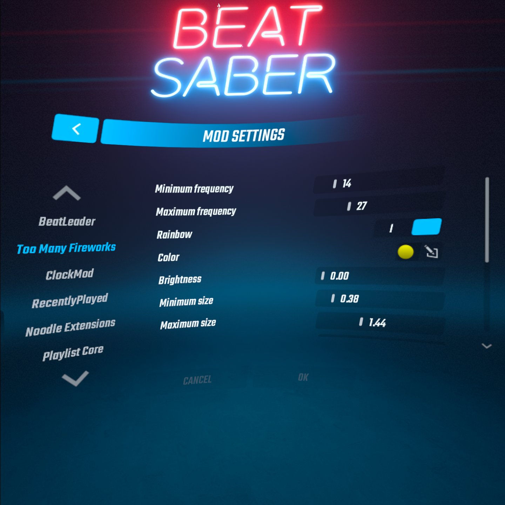

# TooManyFireworks

Don't think there's enough fireworks? This mod adds a variety of settings that can make fireworks powerful enough to explode the game itself!

## Current Options

- Min / max frequency
- Rainbow color
- Specific color
- Brightness
- Min / max size
- Number of sparks
- Duration
- Gravity
- Collisions
- Dampen strength
- Bounce strength
- Volume
- Spawn range
- Enable on high score
- Enable on level clear
- Enable on level fail
- Enable on full combo
- Enable on accuracy
- Enable in main menu
- Enable in level selection
- Enable in gameplay
- Enable in pause menu
- Smooth disable

## Known Bugs

- Color will flicker when a slider is moved with rainbow color on
- Light rays will flicker when a size slider is moved
- Canceling color select will not revert color
- Updating mod menu from main menu will not update values in mod menu from mod settings and vice versa

## Future Ideas

- Show on scoreboard rank
- Color over time
- Spark size
- Turbulence
- Minimum spark speed multiplier
- Different type of firework for each condition
- Color palettes
- Change random sound pitch
- Change audio clips
- Custom sprite
- Cheerleading
- Custom shapes
- Quick preset buttons

Or, I might create a new mod that allows customizability to the whole Unity Particle System for anything and everything!

## Build Instructions

Follow the instructions [here](https://bsmg.wiki/modding/quest-mod-dev-intro.html) to set up the software and learn the basics of compiling mods. After cloning this repository, key terminal commands will be `qpm restore` and `qpm s qmod`.

## Credits

* [zoller27osu](https://github.com/zoller27osu), [Sc2ad](https://github.com/Sc2ad) and [jakibaki](https://github.com/jakibaki) - [beatsaber-hook](https://github.com/sc2ad/beatsaber-hook)
* [raftario](https://github.com/raftario)
* [Lauriethefish](https://github.com/Lauriethefish), [danrouse](https://github.com/danrouse) and [Bobby Shmurner](https://github.com/BobbyShmurner) for [this template](https://github.com/Lauriethefish/quest-mod-template)